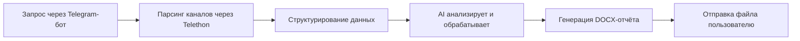

# Руководство по развертыванию Telegram Analytics Platform

## 📋 Для кого это руководство

Это руководство написано для пользователей, которые хотят самостоятельно развернуть систему автоматического парсинга Telegram-каналов и генерации аналитических отчётов с использованием искусственного интеллекта.

Вы сможете настроить систему, которая:
- Автоматически парсит публичные Telegram-каналы
- Извлекает и структурирует данные из сообщений
- Генерирует готовые отчёты в формате DOCX (дайджест новостей, календарь мероприятий и др.)
- Управляется через удобный Telegram-бот

---

## 🎯 Как работает система



**Этапы работы:**

1. **Вы выбираете параметры в Telegram-боте** — подборку каналов, период парсинга и тип отчёта
2. **Система парсит каналы** — собирает сообщения за выбранный период через Telethon API
3. **Искусственный интеллект обрабатывает данные** — анализирует контент и структурирует информацию
4. **Генерируется готовый документ** — DOCX-файл с отчётом по выбранному шаблону
5. **Бот отправляет вам результат** — готовый файл прямо в чат

---

## 💰 Стоимость использования

### Обязательные расходы:
- **Amvera Cloud** (хостинг приложения): от 290₽/месяц (рекомендую тариф за 490₽)
- **Google Gemini API** (Free mode): бесплатно (лимит: ~20 запросов в день для каждой модели)
- **Telegram Bot**: бесплатно
- **Telegram API** (для Telethon): бесплатно

### Опциональные расходы:
- **Polza.ai** (Paid mode, без квотирования): стоимость обработки зависит от объёма данных, примерно 1,5 руб за анализ одной подборки каналов.

---

## 📝 Что вам понадобится

Перед началом настройки зарегистрируйтесь в следующих сервисах:

- [ ] Аккаунт Telegram (для создания бота)
- [ ] Аккаунт Google (для получения API ключа Gemini)
- [ ] Аккаунт Amvera Cloud (для размещения приложения)
- [ ] (Опционально) Аккаунт Polza.ai (для платного режима)

---

## 🔑 ШАГИ 1-4: Получение API ключей

### ШАГ 1: Создание Telegram-бота

**Зачем:** Бот будет принимать ваши запросы и отправлять готовые отчёты.

**Инструкция:**

1. Откройте Telegram и найдите бота **@BotFather**
2. Отправьте команду `/newbot`
3. Придумайте имя для бота
4. Придумайте username для бота (должен заканчиваться на "bot", например, `analytics_parser_bot`)
5. **Сохраните токен**, который вам отправит BotFather — это ваш `TELEGRAM_BOT_TOKEN`
   
   Выглядит примерно так: `7128956790:AAHdqTcvCH1vKOJxfSeofSAs0K5PAOPsaw`

**Как узнать свой User ID (для ограничения доступа):**

1. Найдите бота **@userinfobot** в Telegram
2. Отправьте ему `/start`
3. Он пришлет вам ваш ID (например, `123456789`)
4. Этот ID нужно будет указать в переменной `ALLOWED_USERS`

📚 **Документация:** https://core.telegram.org/bots/tutorial

---

### ШАГ 2: Получение Telegram API ID и API Hash

**Зачем:** Эти ключи необходимы для работы Telethon — библиотеки, которая парсит сообщения из Telegram-каналов.

**Инструкция:**

1. Перейдите на сайт: **https://my.telegram.org/**
2. Войдите, используя номер телефона вашего Telegram-аккаунта
3. Перейдите в раздел **"API development tools"**
4. Заполните форму:
   - **App title:** любое название (например, "Analytics Parser")
   - **Short name:** краткое имя (например, "parser")
   - **Platform:** можно выбрать "Desktop"
   - **Description:** краткое описание (например, "Telegram channel parser")
5. Нажмите **"Create application"**
6. **Сохраните:**
   - `App api_id` — это ваш `TELEGRAM_API_ID`
   - `App api_hash` — это ваш `TELEGRAM_API_HASH`

> ⚠️ **ВАЖНО:** Если у вас включен VPN, при попытке создать приложение может возникнуть ошибка. Отключите VPN перед регистрацией приложения.

> ⚠️ **ВАЖНО:** Эти данные привязаны к вашему Telegram-аккаунту. Никому не передавайте API Hash!

📚 **Документация:** https://core.telegram.org/api/obtaining_api_id

---

### ШАГ 3: Получение Google Gemini API Key

**Зачем:** Это бесплатный ИИ от Google, который будет анализировать данные и генерировать отчёты (Free mode).

**Инструкция:**

1. Перейдите на сайт: **https://ai.google.dev/gemini-api/docs**
2. Нажмите кнопку **"Get API key"** в правом верхнем углу
3. Войдите с помощью вашего Google-аккаунта
4. Нажмите **"Create API key"**
5. Выберите существующий проект или создайте новый
6. **Скопируйте ключ** — это ваш `GOOGLE_API_KEY`
   
   Выглядит примерно так: `AIzaNiB12345678678lCdEfGhIjKlMnOpQrStUvW`

**Лимиты бесплатного использования:**
- ~20 запросов в день на каждую модель
- Достаточно для генерации нескольких отчётов в день

**Поддерживаемые модели:**
- `gemini-2.5-flash` (рекомендуется) — быстрая и точная
- `gemini-3-flash-preview` (новая версия, в тестировании)

> ⚠️ **ВАЖНО:** Модель `gemini-3-flash-preview` находится в стадии preview. После завершения тестирования Google изменит её название (например, на `gemini-3.0-flash`). При изменении названия потребуется обновить файл `services/llm_providers.py`.

📚 **Документация:** https://ai.google.dev/gemini-api/docs

---

### ШАГ 4: Получение Polza.ai API Key (Опционально)

**Зачем:** Платный режим (Paid mode) с более высокими лимитами и стабильностью.

**Когда использовать:**
- Нужна максимальная скорость генерации отчётов
- Исчерпан бесплатный лимит Google Gemini
- Требуется обработка большого объёма данных

**Инструкция:**

1. Перейдите на сайт: **https://polza.ai/**
2. Зарегистрируйтесь на платформе
3. Пополните баланс
4. Перейдите в раздел **"API ключи"**
5. **Скопируйте ключ** — это ваш `POLZA_API_KEY`

📚 **Документация:** https://docs.polza.ai/docs

---

## 🚀 ШАГИ 5-7: Развертывание на Amvera Cloud

### ШАГ 5: Регистрация на Amvera

**Инструкция:**

1. Перейдите на сайт: **https://amvera.ru/**
2. Нажмите **"Войти"** и зарегистрируйтесь
3. Войдите в личный кабинет: **https://cloud.amvera.ru/**

📚 **Документация Amvera:** https://docs.amvera.ru/applications/quick-start.html 

---

### ШАГ 6: Создание проекта в Amvera

**Инструкция:**

1. В личном кабинете нажмите **"Создать"**
2. Выберите тип сервиса: **"Приложение"**
3. Введите название проекта (например, "Telegram Analytics")
4. Нажмите **"Создать проект"**

Вы попадете на страницу проекта с несколькими вкладками:
- **Репозиторий** — здесь будет код приложения
- **Переменные** — здесь нужно указать все API ключи
- **Логи** — здесь можно смотреть, что происходит с приложением
- **Мониторинг**, **Бэкапы**, **Конфигурация**, **Контроль версии** — пока нам не нужны. 

---

### ШАГ 7: Загрузка кода приложения

**У вас есть два варианта:**

#### Вариант А: Загрузка через Git 

📚 **Инструкция:** https://docs.amvera.ru/applications/git.html

#### Вариант Б: Ручная загрузка файлов

> ⚠️ **ВАЖНО:** Amvera **НЕ** поддерживает загрузку ZIP-архивов. Файлы нужно добавлять по одному.

1. Перейдите во вкладку **"Репозиторий"**
2. Нажмите **"Загрузить данные"**
3. Загрузите следующие файлы:
   - `app.py`
   - `telegram_bot.py`
   - `setup_session.py`
   - `requirements.txt`
   - `amvera.yaml`
   - Все файлы вместе с папкой `routers/` (можно загружать папку целиком)
   - Все файлы вместе с папкой `services/` (можно загружать папку целиком)
   - Все файлы вместе с папкой `prompts/` (можно загружать папку целиком)
   - Все файлы вместе с папкой `templates/` (можно загружать папку целиком)

> 💡 **Совет:** При обновлении проекта не удаляйте старые файлы — просто загружайте новые версии поверх существующих.

---

### ШАГ 8: Создание Telethon-сессии (ВАЖНО!)

**Зачем:** Telethon-сессия — это файл авторизации, который позволяет приложению парсить Telegram-каналы от имени вашего аккаунта. **Без этого файла парсер работать не будет!**

**Инструкция (выполняется на вашем компьютере):**

1. Скачайте проект на свой компьютер и распакуйте в удобную папку
2. Откройте командную строку:
   - Нажмите **Win + R** на клавиатуре
   - Введите `cmd` и нажмите **Enter**
3. Перейдите в папку с проектом командой `cd`:
   ```bash
   cd C:\путь\к\папке\с\проектом
   ```
   Например, если проект находится на рабочем столе:
   ```bash
   cd C:\Users\ВашеИмя\Desktop\parser
   ```
4. Установите зависимости:
   ```bash
   pip install -r requirements.txt
   ```
5. Запустите скрипт создания сессии:
   ```bash
   py setup_session.py
   ```
6. Следуйте инструкциям в терминале:
   - Введите ваш `API_ID` и `API_HASH`
   - Введите номер телефона вашего Telegram-аккаунта
   - Введите код подтверждения из Telegram
7. После успешной авторизации в папке появится файл `telegram_parser_session.session`

> ⚠️ **ВАЖНО:** Если у вас включена двухфакторная аутентификация (2FA), потребуется ввести пароль. При вводе пароль **не будет отображаться** в терминале — это нормально. Просто введите пароль и нажмите Enter.

> ⚠️ **КРИТИЧЕСКИ ВАЖНО:** Файл сессии содержит авторизационные данные вашего аккаунта. Никому его не передавайте!

---

### ШАГ 9: Загрузка файлов в папку Data

**Зачем:** В папке `/data/` хранятся конфигурационные файлы:
- `telegram_parser_session.session` — сессия Telethon для парсинга
- `source_1.json` - `source_6.json` — подборки каналов для парсинга

**Инструкция:**

1. Перейдите во вкладку **"Репозиторий"**
2. Переключитесь на вкладку **"Data"** (рядом с "Code")
3. Нажмите **"Загрузить данные"**
4. Загрузите файлы:
   - `telegram_parser_session.session` (созданный на предыдущем шаге)
   - Все файлы `source_*.json` из папки `data/` проекта

> 💡 **Примечание:** Папки `temp/` и `raw_parses/` создавать не нужно — они будут созданы автоматически при первом использовании парсера.

> ⚠️ **КРИТИЧЕСКИ ВАЖНО:** Без файла `telegram_parser_session.session` сервис не сможет парсить каналы!

📚 **Документация:** https://docs.amvera.ru/applications/storage.html

---

### ШАГ 10: Настройка переменных окружения

**Инструкция:**

1. Перейдите во вкладку **"Переменные"**
2. Нажмите **"Добавить переменную"**
3. Добавьте все переменные из таблиц ниже

#### Таблица обязательных переменных:

| Название переменной | Значение | Это секрет? | Описание |
|---------------------|----------|-------------|----------|
| `TELEGRAM_BOT_TOKEN` | Ваш токен от @BotFather | ✅ Да | Токен Telegram-бота |
| `TELEGRAM_API_ID` | Ваш API ID от my.telegram.org | ✅ Да | ID для Telethon |
| `TELEGRAM_API_HASH` | Ваш API Hash от my.telegram.org | ✅ Да | Hash для Telethon |
| `GOOGLE_API_KEY` | Ваш ключ Google Gemini | ✅ Да | API ключ для Free mode |
| `WEBHOOK_HOST` | URL вашего приложения | ❌ Нет | Публичный URL (см. следующий шаг) |
| `ALLOWED_USERS` | Ваш User ID из Telegram | ❌ Нет | Список ID через запятую, после запятой пробел |

#### Опциональные переменные:

| Название переменной | Значение по умолчанию | Это секрет? | Описание |
|---------------------|----------------------|-------------|----------|
| `POLZA_API_KEY` | — | ✅ Да | Для Paid mode (если нужен) |
| `ADMIN_TOKEN` | — | ✅ Да | Токен для /admin/ эндпоинтов |
| `API_TIMEOUT` | `900` | ❌ Нет | Время ожидания ответа от LLM (секунды) |
| `RETENTION_DAYS` | `7` | ❌ Нет | Количество дней хранения файлов парсинга |
| `ENABLE_MEMORY_CLEANUP` | `true` | ❌ Нет | Включение менеджера памяти |
| `ENABLE_FILE_CLEANUP` | `true` | ❌ Нет | Включение автоочистки файлов |

**Как добавить переменную:**

1. Введите **Название** (например, `TELEGRAM_BOT_TOKEN`)
2. Введите **Значение** (например, ваш токен)
3. Если это API ключ или токен — поставьте галочку **"Это секрет"**
4. Нажмите **"Применить"**

> ⚠️ **ВАЖНО:** Переменную `WEBHOOK_HOST` пока оставьте пустой — мы добавим её на следующем шаге.

---

### ШАГ 11: Первый запуск и получение URL

**Инструкция:**

1. Перейдите во вкладку с вашим приложением "https://cloud.amvera.ru/projects/applications/your-project" 
2. Нажмите кнопку **Пересобрать проект**
3. Подождите 2-5 минут — Amvera установит все зависимости и запустит приложение
4. Следите за процессом во вкладке **"Логи"**. Могут появиться ошибки — не переживайте. Это нормально на первых этапах, пока не заполнены все переменные и не активирован бесплатный домен.

**Статусы:**
- **"Сборка"** — устанавливаются библиотеки Python
- **"Запуск"** — приложение запускается
- **"Приложение запущено"** — все готово!

**После успешного запуска:**

1. Перейдите во вкладку **"Домены"**
2. Нажмите **"Создать доменное имя"**
3. Выберите тип HTTPS, бесплатный домен Amvera, применить
   
   Выглядит примерно так: `https://your-project-name.amvera.io`

📚 **Документация:** https://docs.amvera.ru/applications/configuration/network.html 

---

### ШАГ 12: Настройка Webhook для Telegram

**Зачем:** Telegram должен знать, куда отправлять сообщения для вашего бота.

**Инструкция:**

1. Вернитесь во вкладку **"Переменные"**
2. Добавьте переменную `WEBHOOK_HOST`
3. Вставьте скопированный URL (например, `https://your-project-name.amvera.io`)
4. Нажмите **"Применить"**
5. В правом верхнем углу найдите кнопку в форме ящика "пересобрать проект" и нажмите на неё. Каждый раз когда вы удаляете, добавляете файлы или обновляете переменные, необходимо пересобирать проект.

**Проверка:**

1. Откройте Telegram
2. Найдите вашего бота по username
3. Отправьте команду `/start` 
4. Если бот ответил — все работает! ✅

---

## 📱 Как использовать бота

### Пошаговая инструкция

1. **Откройте чат с ботом в Telegram**
   - Найдите бота по username
   - Отправьте команду `/start`

2. **Выберите подборку каналов**
   - Бот предложит выбрать одну из подборок (source_1 - source_6)
   - Каждая подборка содержит список Telegram-каналов для парсинга

3. **Выберите период парсинга**
   - **Сегодня** — сообщения за текущий день
   - **Вчера** — сообщения за вчерашний день
   - **Указать количество дней** — от 1 до 365 дней назад

4. **Выберите тип отчёта**
   - **Дайджест новостей** — структурированная сводка новостей
   - **Календарь мероприятий** — извлечение дат и событий
   - **Custom Task 1/2** — дополнительные сценарии обработки

5. **Выберите режим обработки**
   - **Free mode** — бесплатный (Google Gemini)
   - **Paid mode** — платный (Polza.ai)

6. **Выберите модель AI** (для Free mode)
   - **Flash 2.5** — рекомендуется (стабильная версия)
   - **Flash 3.0** — новая версия в preview
   
   > 💡 **Совет:** Модель Flash 3.0 находится в тестировании. Если она не работает — используйте Flash 2.5 либо проверьте на сайте Google AI Studio актуальное название модели и обновите код.

7. **Дождитесь результата**
   - Бот отправит уведомление о начале обработки
   - После завершения вы получите готовый DOCX-файл

### Время обработки:

- **Небольшая подборка (5-10 каналов, 1 день):** 30-60 секунд на Polza.ai и до 3 минут на Free mode
- **Средняя подборка (20-30 каналов, 1 день):** 1-2 минуты на Polza.ai и 5-7 минут на Free mode

---

## 🔧 Гибкость системы: как адаптировать под свои нужды

### ⭐ КЛЮЧЕВАЯ ИДЕЯ

Система полностью настраивается под ваши задачи! Вы можете изменять:

1. **`source_*.json`** — подборки каналов для парсинга
2. **Промпты** (`prompts/*.md`) — инструкции для ИИ
3. **Шаблоны** (`templates/*.docx`) — шаблоны DOCX-документов

---

### 📋 Как редактировать подборки каналов (source_*.json)

**Что такое source.json:**
- JSON-файл со списком Telegram-каналов для парсинга
- Каждый файл (`source_1.json` - `source_6.json`) — отдельная подборка
- Можно создавать тематические подборки под разные задачи

**Где находятся:**
- В папке `/data/` на Amvera (вкладка "Репозиторий" → "Data")
- Локально: в папке `data/` проекта

**Формат файла:**

```json
[
  "https://t.me/channel_name1",
  "https://t.me/channel_name2",
  "t.me/channel_name3",
  "@channel_name4"
]
```

**Поддерживаемые форматы ссылок:**
- `https://t.me/channel_name` — полная ссылка
- `t.me/channel_name` — ссылка без https
- `@channel_name` — только username канала
- `t.me/channel_name/12345` — ссылка на конкретный пост (парсер извлечёт имя канала)

**Пример минимальной подборки:**

```json
[
  "https://t.me/habr_com",
  "https://t.me/tjournal",
  "https://t.me/vc_ru"
]
```

**Как обновить подборку:**

1. Скачайте файл `source_*.json` из Amvera (вкладка "Data")
2. Отредактируйте в блокноте
3. Добавьте или удалите ссылки на каналы
4. Загрузите файл обратно в Amvera
5. Пересоберите проект

> ⚠️ **ВАЖНО:** 
> - Файл должен быть валидным JSON (проверьте запятые!)
> - Парсер работает только с **публичными** каналами
> - Приватные каналы парсить нельзя

---

### 📝 Как редактировать промпты

**Что такое промпт:**
- Инструкция для искусственного интеллекта
- Определяет, как обрабатывать данные и что извлекать
- Написана на русском языке в формате Markdown

**Доступные промпты:**

| Файл | Тип отчёта | Описание |
|------|-----------|----------|
| `prompts/news.md` | Дайджест новостей | Структурирование новостей по темам |
| `prompts/events.md` | Календарь мероприятий | Извлечение дат, событий, конференций |
| `prompts/custom_task_1.md` | Custom Task 1 | Дополнительный сценарий |
| `prompts/custom_task_2.md` | Custom Task 2 | Дополнительный сценарий |

**Как редактировать:**

1. Промпты находятся в папке `prompts/` в репозитории (вкладка "Code")
2. Скачайте нужный файл
3. Отредактируйте инструкции
4. Загрузите обратно и пересоберите проект

**Рекомендации:**

- Пишите чёткие и конкретные инструкции
- Указывайте формат вывода (структура, разделы)
- Добавляйте примеры желаемого результата
- Тестируйте на небольших подборках

---

### 📄 Как редактировать шаблоны DOCX

**Что такое шаблон:**
- Файл Word (.docx) с плейсхолдерами Jinja2
- Определяет внешний вид итогового документа
- Данные от ИИ автоматически подставляются в плейсхолдеры

**Где находятся:**
- В папке `templates/` в репозитории

**Синтаксис Jinja2:**

```
{{variable_name}}        — подстановка значения
...  — условие
...  — цикл
```

**Пример использования:**

```
Дайджест за {{ report_date }}

{{ report_content }}

Сгенерировано автоматически.
```

---

### ⚠️ Важные рекомендации при модификации

1. **Тестируйте на небольших подборках**
   - Сначала проверьте на 2-3 каналах
   - Убедитесь, что ИИ правильно понял инструкции

2. **Сохраняйте резервные копии**
   - Перед изменением скачайте текущие файлы
   - Храните версии с датами

3. **Пишите чёткие инструкции в промптах**
   - Плохо: "Найди новости"
   - Хорошо: "Найди все новости, сгруппируй по темам, укажи источник и дату"

4. **Проверяйте JSON-синтаксис**
   - Используйте онлайн-валидаторы JSON
   - Следите за запятыми и кавычками

---

## 🐛 Устранение неполадок

### Проблема: Бот не отвечает

**Решения:**

1. Проверьте, что приложение работает:
   - Amvera → "Логи" → "Лог приложения"
   - Скопируйте ошибки и спросите у ChatGPT/Claude в чём проблема

2. Проверьте переменную `WEBHOOK_HOST`:
   - Amvera → "Переменные"
   - Должна быть указана правильная ссылка (например, `https://your-project.amvera.io`)
   - Пересоберите проект после изменения

3. Проверьте ID пользователя:
   - Если указана переменная `ALLOWED_USERS`, убедитесь что ваш ID там есть

📚 **См. также:** https://docs.amvera.ru/general/faq.html 

---

### Проблема: Парсер не работает / ошибка Telethon

**Решения:**

1. **Проверьте файл сессии:**
   - Убедитесь, что `telegram_parser_session.session` загружен в `/data/`
   - Сессия должна быть создана с вашими `API_ID` и `API_HASH`

2. **Проверьте переменные:**
   - `TELEGRAM_API_ID` и `TELEGRAM_API_HASH` должны совпадать с теми, что использовались при создании сессии

3. **Пересоздайте сессию:**
   - Запустите `python setup_session.py` заново на локальном компьютере
   - Загрузите новый файл `.session` в Amvera

---

### Проблема: ИИ выдает ошибку или некорректный результат

**Решения:**

1. **Проверьте лимиты API:**
   - Google Gemini имеет ограничение ~20 запросов в день
   - Попробуйте другую модель или Paid mode

2. **Уточните промпт:**
   - Откройте соответствующий файл в `prompts/`
   - Добавьте больше деталей и примеров

3. **Уменьшите период парсинга:**
   - Попробуйте парсить за 1 день вместо недели

---

### Проблема: Ошибка сборки или запуска

**Решения:**

1. **Посмотрите логи сборки:**
   - Amvera → "Логи" → вкладка "Логи сборки"
   - Найдите строку с ошибкой

2. **Проверьте наличие всех файлов:**
   - Все папки (`routers/`, `services/`, `prompts/`, `templates/`) загружены
   - Файл `requirements.txt` присутствует

---

## 📚 Полезные ссылки

### Документация сервисов:

- **Google Gemini API:** https://ai.google.dev/gemini-api/docs
- **Polza.ai:** https://docs.polza.ai/docs
- **Amvera Cloud:** https://docs.amvera.ru/
- **Telegram Bot API:** https://core.telegram.org/bots
- **Telethon:** https://docs.telethon.dev/

### Поддержка:

- **Email Amvera:** support@amvera.ru
- **Telegram сообщество Amvera:** https://t.me/amvera_chat

---

## ✅ Чек-лист готовности к запуску

Перед первым использованием системы убедитесь, что:

### API Ключи:
- [ ] Получен `TELEGRAM_BOT_TOKEN`
- [ ] Получены `TELEGRAM_API_ID` и `TELEGRAM_API_HASH`
- [ ] Получен `GOOGLE_API_KEY`
- [ ] (Опционально) Получен `POLZA_API_KEY`

### Telethon-сессия:
- [ ] Установлены зависимости локально (`pip install -r requirements.txt`)
- [ ] Запущен `python setup_session.py`
- [ ] Введены `API_ID`, `API_HASH`, номер телефона и код подтверждения
- [ ] Получен файл `telegram_parser_session.session`

### Amvera:
- [ ] Зарегистрирован аккаунт
- [ ] Пополнен баланс
- [ ] Создан проект
- [ ] Загружен код приложения (вкладка "Code")
- [ ] Загружены файлы в `/data/`: сессия и `source_*.json` (вкладка "Data")
- [ ] Добавлены все переменные окружения
- [ ] Приложение успешно собралось и запустилось
- [ ] Получен публичный URL приложения
- [ ] Добавлена переменная `WEBHOOK_HOST` с URL
- [ ] Приложение перезапущено после добавления `WEBHOOK_HOST`

### Telegram:
- [ ] Бот отвечает на команду `/start`
- [ ] Ваш User ID добавлен в `ALLOWED_USERS` (если используется ограничение)

### Тестирование:
- [ ] Выбрана тестовая подборка каналов
- [ ] Бот успешно сгенерировал отчёт
- [ ] Получен DOCX-файл

---

## 🎉 Готово!

Поздравляем! Вы успешно развернули Telegram Analytics Platform.

Теперь вы можете:
- Парсить публичные Telegram-каналы
- Генерировать аналитические отчёты с помощью ИИ
- Настраивать подборки каналов под свои задачи
- Редактировать промпты для разных типов отчётов

Удачи в работе! 🚀
